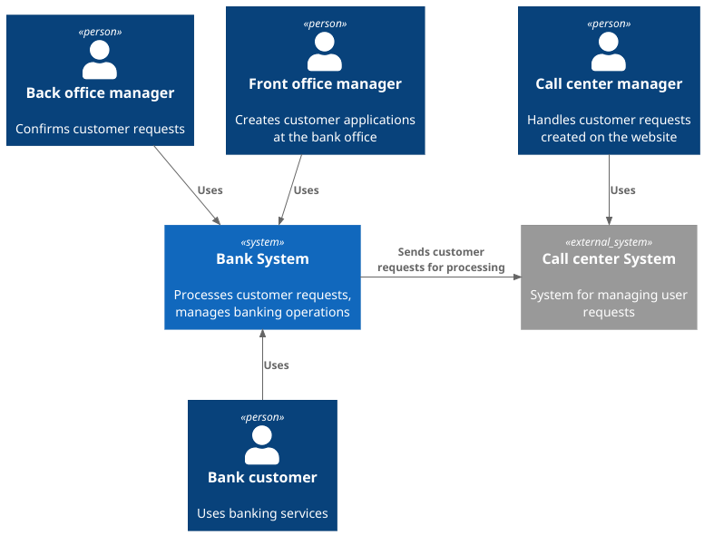
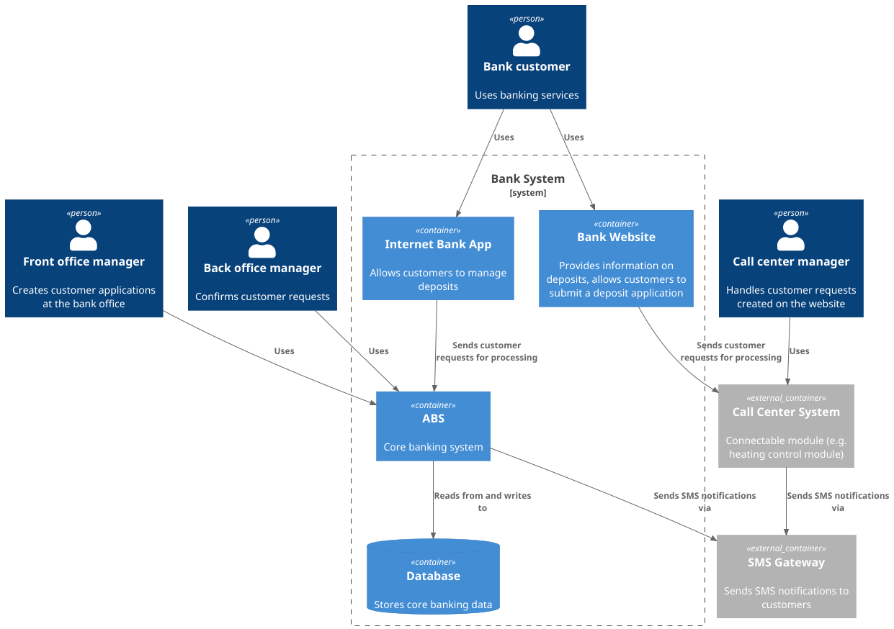

### **Название задачи:** MVP Открытие депозитов онлайн

### **Автор:** Ильдар Зарипов

### **Дата:** 2026-01-17

### **Функциональные требования**

Опишите здесь верхнеуровневые Use Cases. Их нужно оформить в виде таблицы с пошаговым описанием:

| **№** | **Действующие лица или системы** | **Use Case**               | **Описание**                                                                                                                                                                                       |
|:-----:|:---------------------------------|:---------------------------|:---------------------------------------------------------------------------------------------------------------------------------------------------------------------------------------------------|
|  UC1  | Клиент, сайт                     | Оставить заявку на депозит | 1. Клиент просматривает список доступных депозитов на сайте. 2. Клиент оформляет заявку на депозит с указанием ФИО и номера телефона.                                                          |
|  UC2  | Сотрудник КЦ, система КЦ         | Обработка заявки           | 1. Сотрудник КЦ просматривает заявку. 2. Сотрудник КЦ связывается с клиентом для предложения условий.                                                                                      |
|  UC3  | Клиент, интернет-банк            | Оставить заявку на депозит | 1. Клиент просматривает список доступных депозитов в интернет-банке. 2. Клиент подаёт заявку на депозит с указанием суммы и счёта депозита. 3. Клиент подтверждает операцию с помощью СМС. |
|  UC4  | Сотрудник бэк-офиса, АБС         | Одобрение заявки           | 1. Сотрудник бэк-офиса подтверждает условия депозита. 2. Клиент получает СМС-уведомление после подтверждения.                                                                                  |

### **Нефункциональные требования**

Опишите здесь нефункциональные требования и архитектурно значимые требования.

| **№** | **Требование**                                  |
|:-----:|:------------------------------------------------|
|  R1   | Доступность 24/7.                               |
|  R2   | SLA 99.9%.                                      |
|  P1   | Отклик по всем операциям должен занимать < 1 с. |
|  +R1  | Требуется шифрование трафика.                   |

### **Решение**

#### Диаграмма контекста

#### Диаграмма контейнеров

### **Альтернативы**

Реализовать асинхронное взаимодействие между интернет-банком и АБС через очередь сообщений для
обработки заявок на депозиты.

**Недостатки, ограничения, риски**

1. Все заявки будут обрабатываться вручную сотрудниками КЦ и бэк-офиса, что может привести к
   задержкам в обработке заявок при высоком объеме запросов.
2. Отсутствие автоматизации может увеличить вероятность ошибок при вводе данных сотрудниками.
3. Прямой доступ к АБС может создать дополнительные риски безопасности, если не будут реализованы
   надлежащие меры защиты.
4. Прямой доступ к БД АБС может увеличить нагрузку на систему и повлиять на производительность при
   большом количестве заявок.
