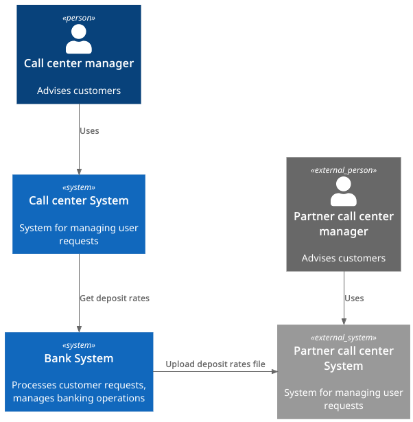
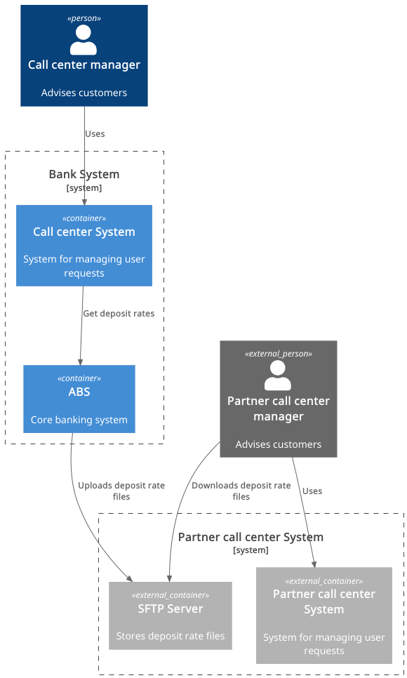

### **Название задачи:** MVP Передача ставок в КЦ

### **Автор:** Ильдар Зарипов

### **Дата:** 2026-01-18

### **Функциональные требования**

Опишите здесь верхнеуровневые Use Cases. Их нужно оформить в виде таблицы с пошаговым описанием:

| **№** | **Действующие лица или системы**      | **Use Case**                                     | **Описание**                                                                                                                                                                              |
|:-----:|:--------------------------------------|:-------------------------------------------------|:------------------------------------------------------------------------------------------------------------------------------------------------------------------------------------------|
|  UC1  | Сотрудник КЦ, система КЦ              | Сотрудник КЦ может просмотреть актуальную ставку | Сотрудник КЦ может просмотреть актуальные ставки в системе КЦ и проконсультировать клиента.                                                                                               |
|  UC2  | Сотрудник партнерского КЦ, FTP сервер | Сотрудник КЦ может просмотреть актуальную ставку | 1. Раз в сутки ставки загружаются в виде XLS файла на SFTP-сервер 2. Сотрудникам партнерского КЦ может просмотреть ставки загрузив XLS файл с SFTP-сервера для консультации клиентов. |

### **Нефункциональные требования**

Опишите здесь нефункциональные требования и архитектурно значимые требования.

| **№** | **Требование**                                                        |
|:-----:|:----------------------------------------------------------------------|
|  R1   | Доступность 24/7.                                                     |
|  R2   | SLA 99.9%.                                                            |
|  P1   | Отклик по всем операциям должен занимать < 1 с.                       |
|  +R1  | Требуется шифрование трафика.                                         |
|  +R2  | Файлы на SFTP-сервере должны быть защищены.                           |
|  +R3  | Формат данных должен быть согласован с партнерским КЦ.                |
|  +R4  | Актуализация ставок на SFTP севере должны быть не реже 1 раза в день. |

### **Решение**

#### Диаграмма контекста

#### Диаграмма контейнеров

### **Альтернативы**

Автоматизация передачи ставок через API.

**Недостатки, ограничения, риски**

1. Риск устаревания информации при сбоях в процессе передачи.
2. Необходимость контроля безопасности при передаче файлов (пароли, шифрование).
3. Возможна перегрузка КЦ при большом количестве обращений, требуется мониторинг нагрузки.
